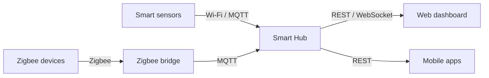

# System architecture

```mermaid
flowchart LR
  S[Smart sensors] -- Wi-Fi / MQTT --> H[Smart Hub]
  Z[Zigbee devices] -- Zigbee --> B[Zigbee bridge] -- MQTT --> H
  H -- REST / WebSocket --> D[Web dashboard]
  H -- REST --> M[Mobile apps]
```

## Components
## Data flow
## Security model
